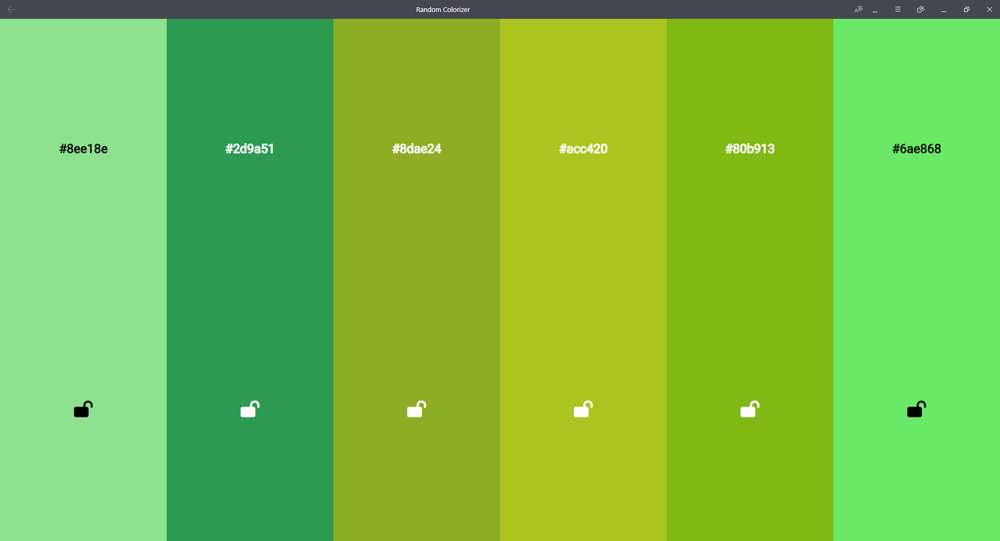
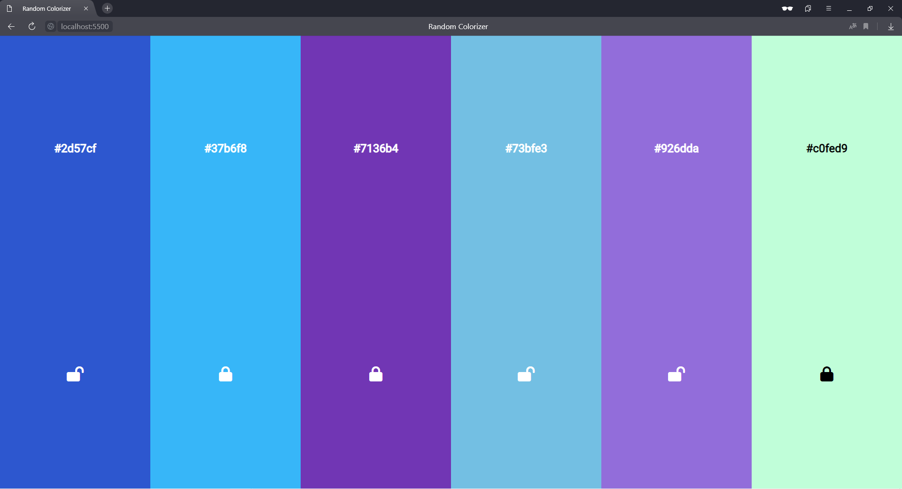
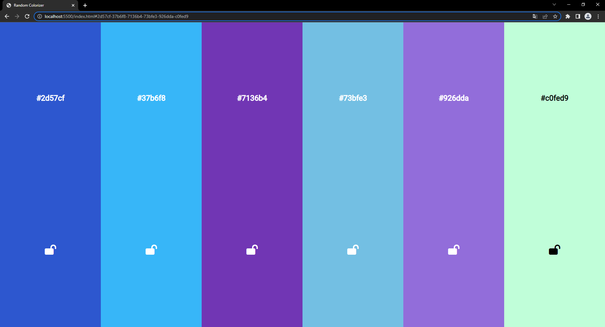

# RandomColorizer

**Генератор цветов для оптимального подбора палитры**

Инструмент позволяет генерировать цвета случайным образом. С помощью клавиши Space (Пробел) можно обновлять цвета.

---

Также возможно блокировать цвет с помощью закрытия замка. При блокировке после нажатия кнопки обновления (Space) цвета не претерпят изменений.

---

При создании цветов генерируется hash URL-адреса (например : #adad6a-bcd6fe-705677-3b1d6a-331a0d-a77ecb), который содержит всю палитру, показанную на странице.
Это позволяет обмениваться необходимым сочетанием цветов между пользователями.

---

